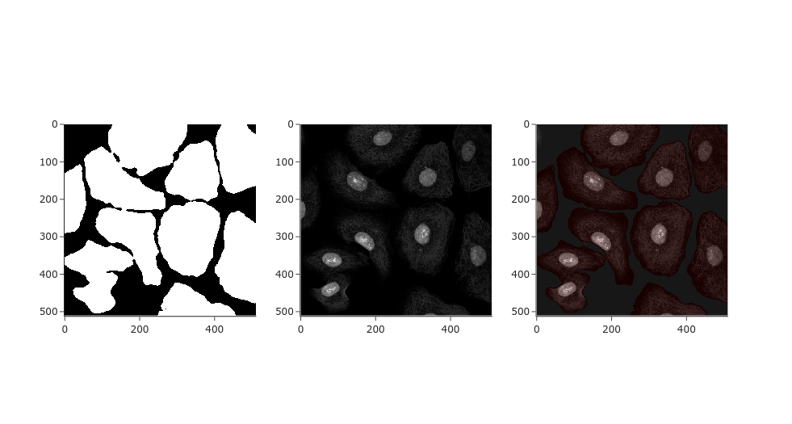
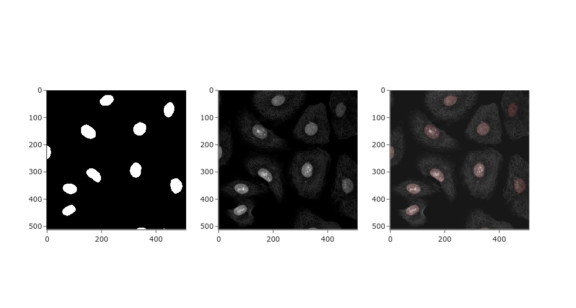

Cell and Nuclei Segmentation
==============================

The purpose of this project is to predict the masks of the nuclei and the cells for a given dataset.


## Prerequisites
The [requirements.txt](requirements.txt) file includes the project dependencies.


## Folder Structure

<p><small>Project based on a modified <a target="_blank" href="https://drivendata.github.io/cookiecutter-data-science/">cookiecutter data science project template</a>.</small></p>

    ├── LICENSE
    ├── Makefile           <- Makefile with commands like `make data` or `make train`
    ├── README.md          <- The top-level README for developers using this project
    ├── data
    │   ├── generate       <- Masks generated after using source/evaluate/generate_masks.py
    │   ├── original       <- The original, immutable data dump
    │   │   ├── rgb               <- The rgb images of cells
    │   │   ├── hpa_cell_mask     <- The masks of cells
    │   │   └── hpa_nuclei_mask   <- The masks of nuclei
    │   └── prepocessed    <- Data preprocessed and split into train, validation, and test sets        
    │
    ├── docs               <- A default Sphinx project; see sphinx-doc.org for details
    │
    ├── output             <- Trained and serialized models, model predictions, or model summaries
    │
    ├── notebooks          <- Jupyter notebooks. Naming convention is a number (for ordering),
    │                         the creator's initials, and a short `-` delimited description, e.g.
    │                         `1.0-jqp-initial-data-exploration`.
    │
    ├── references         <- Data dictionaries, manuals, and all other explanatory materials.
    │
    ├── reports            <- Generated analysis as HTML, PDF, LaTeX, etc.
    │   └── figures        <- Generated graphics and figures to be used in reporting
    │
    ├── requirements.txt   <- The requirements file for reproducing the analysis environment, e.g.
    │                         generated with `pip freeze > requirements.txt`
    │
    ├── setup.py           <- makes project pip installable (pip install -e .) so source can be imported
    ├── source                <- Source code for use in this project.
    │   ├── __init__.py    <- Makes source a Python module
    │   │
    │   ├── dataset
    │   │   └── dataset.py <- Pytorch custom dataset
    │   │
    │   ├── preprocess       <- Scripts to preprocess raw data
    │   │   └── preprocess_data.py
    │   │
    │   ├── train       <- Scripts to train an image segmentation model
    │   │   └── train.py
    │   │
    │   ├── evaluate  <- Scripts to evaluate the trained model
    │   │   │                 and generate masks
    │   │   ├── evaluate.py
    │   │   └── generate_masks.py
    │   │
    │   ├── model  <- Scripts of the Deep Learning models
    │   ├── arguments.py
    │   ├── logger.py
    │   ├── loss.py
    │   ├── metrics.py
    │   └── utils.py
    │
    └── tests        <- integration and unit tests to test the pipeline
        ├── integration
        └── unit  

--------

## Dataset
The data used was originally published for the Kaggle competition
[hpa single cell image classification](https://www.kaggle.com/c/hpa-single-cell-image-classification/data).
However, this project is based on the preprocessed dataset [HPA: 512x512 dataset](https://www.kaggle.com/tchaye59/hpa512x512dataset)
and the masks dataset [hpa-mask](https://www.kaggle.com/its7171/hpa-mask). 
Both datasets have the license [CC0: Public Domain](https://creativecommons.org/publicdomain/zero/1.0/).
Therefore, they can be used without copyright issues.

The training and testing of the models is only based on the zip file `rgb_train.zip` from [HPA: 512x512 dataset](https://www.kaggle.com/tchaye59/hpa512x512dataset)
. The images in this zip file should be placed in [data/original/rgb](data/original/rgb).
Both directories in [hpa-mask](https://www.kaggle.com/its7171/hpa-mask) should
be placed in  [data/original](data/original).

## Usage
A ```Makefile``` is used to preprocess the data, train the models, 
evaluate the models, and generate masks. For more information, make sure to
check the [Makefile](Makefile).
### Preprocess
First, make sure to download the data and place it
as explained in the ```Dataset``` section above. It is possible to modify
some parameters like the expected image size by passing the corresponding
arguments. Then, run the following command

```
make preprocess
```
### Train
The training scripts assume that the data is preprocessed and saved to
the directory [data/preprocessed](data/preprocessed). You can train a nuclei model and
a cells model. You can modify parameters like the optimizer, 
device, batch_size, ...

To train a cell model, run the following command
```
make train_cells
```
To train a nuclei model, run the following command
```
make train_nuclei
```
### Evaluate
To evaluate the nuclei model, run the following
```
make evaluate_nuclei
```
To evaluate the cells model, run the following
```
make evaluate_cells
```


### Generate
In order to generate masks for a specific image, you need to place 
it in  [data/generate](data/generate). It is assumed that the original 
images have one of the following extensions .tif, .nd2, .png, .jpeg. 
Other extensions are not supported. The generated masks have .png extension.
The nuclei masks can be found in [data/generate/masks/nuclei](data/generate/masks/nuclei).
The cells masks can be found in [data/generate/masks/cell](data/generate/masks/cell).

Examples of generated masks can be found in the directories [data/generate/masks/nuclei](data/generate/masks/nuclei)
and [data/generate/masks/cell](data/generate/masks/cell)

It is possible to change the contrast of the cells images before generating the masks.
To generate nuclei masks and cells masks based on the train models, run the following commands
```
make generate_nuclei_mask
make generate_cells_mask
```

## Results
The report in the directory [reports](reports) summarizes the results.
The csv file [output/results.csv](output/results.csv) summarizes 22 experiments. 
The notebooks in the directory [notebooks](notebooks) were used to generate
the plots documented in the report. 




## Contributors
[](https://orcid.org/0000-0001-8109-9644) 
[Maroua Jaoua](https://orcid.org/0000-0001-8109-9644)

# License

The license for this repository is 
[MIT License](LICENSE). 

## TODO

- Write integration and unit tests
